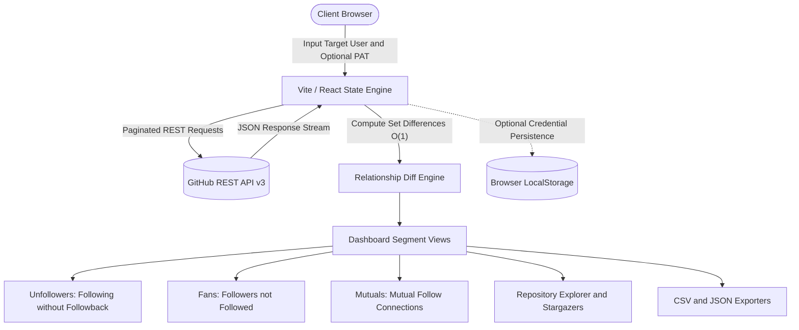

<!-- well-document · audit scorecard: G1:5 G2:5 G3:5 G4:5 G5:5 G6:5 · STATUS: PASS -->

<div align="center">
  
</div>

# WhoDisGit: GitHub Unfollowers and Profile Analytics Dashboard

<div align="center">
  <a href="https://github.com/AtaCanYmc/WhoDisGit/actions/workflows/ci.yml"></a>
  
  
  
  
  
  <a href="LICENSE"></a>
</div>

---

## Table of Contents

- [Overview](#overview)
- [System Architecture](#system-architecture)
- [Features](#features)
- [Tech Stack](#tech-stack)
- [Quick Start](#quick-start)
  - [Prerequisites](#prerequisites)
  - [Installation and Execution](#installation-and-execution)
  - [Makefile Targets](#makefile-targets)
- [URL Query Parameters and Deep Linking](#url-query-parameters-and-deep-linking)
- [Deployment](#deployment)
  - [Automated Deployment (GitHub Actions)](#automated-deployment-github-actions)
  - [Manual Deployment](#manual-deployment)
- [Frequently Asked Questions](#frequently-asked-questions)
- [Governance and Policies](#governance-and-policies)
- [License](#license)

---

## Overview

WhoDisGit is a client-side web application built with React, TypeScript, and Tailwind CSS. It communicates directly with the GitHub REST API v3 to analyze follower networks, calculate reciprocity, and aggregate repository statistics.

The application computes three distinct relationship subsets:
- **Unfollowers**: Accounts followed by the target user that do not follow back.
- **Fans**: Accounts following the target user that the user does not follow back.
- **Mutuals**: Accounts where both users follow each other.

The application runs entirely within the client browser. No user data, credentials, or telemetry are transmitted to intermediate servers.

---

## System Architecture



---

## Features

- **Reciprocal Matching Engine**: Computes non-reciprocal relationships using hash set lookups with $O(1)$ complexity.
- **Paginated GitHub API Traversal**: Automatically paginates through follower lists (`per_page=100`) for high-volume profiles.
- **Stargazer Aggregation**: Summarizes star counts across all public repositories in real time.
- **Authentication Flexibility**: Operates anonymously with standard quotas (60 requests/hour) or with an optional Personal Access Token (5,000 requests/hour).
- **Zero Remote Telemetry**: Runs client-side. Sensitive tokens reside solely in volatile browser memory or `localStorage`.
- **Deep Linking and Raw Output Mode**: Supports URL parameter prefilling (`?username=&pat=`) and an embedded JSON data viewer (`&raw=1`).
- **Repository Explorer**: Real-time keyword search, fork filtering, primary language tags, and multi-criteria sorting by stars, update date, or name.
- **Internationalization**: Full interface localization for English, Turkish, Spanish, German, and French.
- **Dark and Light Theme**: Theme system powered by Tailwind CSS v4 custom variants.
- **Tabular Data Export**: Client-side CSV and JSON export for user lists and repository datasets.
- **PWA Ready**: Web App Manifest with maskable icons for installation on desktop and mobile platforms.

---

## Tech Stack

| Layer | Technology | Version | Purpose |
| :--- | :--- | :---: | :--- |
| **Framework** | React | 18.3 | Component hierarchy and application state |
| **Language** | TypeScript | 5.5 | Type contracts, compile-time safety, and interfaces |
| **Styling** | Tailwind CSS | 4.0 | Responsive design system and dark theme variants |
| **Bundler** | Vite | 5.4 | Development server and production Rollup compilation |
| **Icons** | Lucide React | 0.469 | Tree-shakeable SVG icon components |
| **API Provider** | GitHub REST API | v3 | Data source for profiles, relationships, and repositories |

---

## Quick Start

### Prerequisites

- Node.js 18.0.0 or higher
- npm, pnpm, or yarn

### Installation and Execution

1. Clone the repository:
   ```bash
   git clone https://github.com/AtaCanYmc/WhoDisGit.git
   cd WhoDisGit
   ```

2. Install dependencies:
   ```bash
   npm install
   ```

3. Start the development server:
   ```bash
   npm run dev
   ```
   Open `http://localhost:3000` (or the port displayed in the terminal output).

4. Compile for production:
   ```bash
   npm run build
   ```

### Makefile Targets

A `Makefile` is included for developer convenience:

```bash
make help        # Display all available targets
make install     # Install npm dependencies
make dev         # Run Vite development server
make build       # Compile TypeScript and generate production bundle
make preview     # Locally preview the production build
make type-check  # Execute tsc --noEmit
make ci          # Run CI verification (type-check and production build)
make clean       # Remove build output directory (dist)
make clean-all   # Remove dist and node_modules
make deploy      # Build and deploy to GitHub Pages
```

---

## URL Query Parameters and Deep Linking

WhoDisGit supports URL query parameters for automated query workflows and headless viewing:

| Parameter | Type | Default | Description |
| :--- | :--- | :---: | :--- |
| `username` | String | — | GitHub login handle to query automatically upon mounting. |
| `pat` | String | — | Personal Access Token to apply for GitHub API authorization headers. |
| `raw` | Integer (`0` or `1`) | `0` | Setting to `1` renders raw API JSON payload with a one-click copy button. |

### Example

```text
https://atacanymc.github.io/WhoDisGit/?username=torvalds&raw=0
```

---

## Deployment

### Automated Deployment (GitHub Actions)

Continuous delivery is automated via `.github/workflows/deploy.yml`.

1. Push commits to the `main` branch.
2. In repository settings, navigate to **Settings > Pages > Build and deployment > Source** and select **GitHub Actions**.
3. Deployments execute on every push to `main`.

### Manual Deployment

To publish directly to the `gh-pages` branch from the terminal:

```bash
npm run deploy
# or: make deploy
```

---

## Frequently Asked Questions

#### Is a GitHub Personal Access Token (PAT) required?
No. Any public GitHub profile can be searched without authentication. Unauthenticated requests are subject to the GitHub IP rate limit of 60 requests per hour. Supplying a PAT with public read permissions increases this quota to 5,000 requests per hour.

#### How are credentials stored and handled?
WhoDisGit is a static web application without a backend service. Personal Access Tokens are held in browser memory during the session. If the persistence toggle is selected, the token is written to `window.localStorage`. Tokens are transmitted exclusively to `https://api.github.com` over HTTPS.

#### Can I unfollow users directly from WhoDisGit?
No. WhoDisGit is strictly read-only. Modifying follow relationships requires the `user:follow` write scope. To minimize security exposure, WhoDisGit does not request write scopes. Links are provided to open user profiles directly on GitHub.

#### What happens when rate limits are exceeded?
When GitHub returns an HTTP 403 response indicating rate limit exhaustion, the interface displays an error banner noting the reset time extracted from the `x-ratelimit-reset` response header. Providing a Personal Access Token resolves the rate limit immediately.

---

## Governance and Policies

- [Contributing Guide](CONTRIBUTING.md): Branching model, Conventional Commits specification, and PR submission checklist.
- [Security Policy](SECURITY.md): Supported versions matrix, data boundaries, and private vulnerability disclosure workflow.
- [Changelog](CHANGELOG.md): Historical record of versions, features, and fixes formatted per Keep a Changelog.
- [Roadmap](ROADMAP.md): Current milestone status and planned upcoming releases.
- [Code of Conduct](CODE_OF_CONDUCT.md): Community participation and enforcement standards.

---

## License

This project is licensed under the [MIT License](LICENSE).

