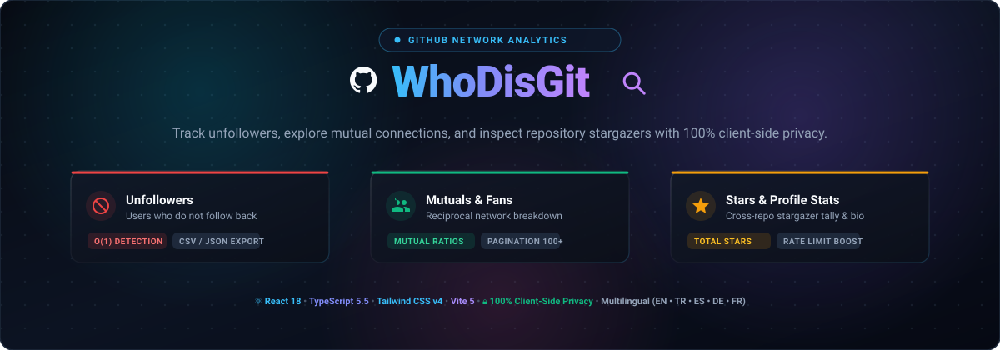

<p align="center">
  
</p>

# WhoDisGit — GitHub Unfollowers & Profile Analytics Dashboard

<p align="center">
  
  
  
  
  
  
</p>

---

## About WhoDisGit

WhoDisGit is a single-page web dashboard built with React, TypeScript, and Tailwind CSS. It connects to the public GitHub REST API to audit your follower relationships, highlight non-reciprocal connections, and calculate repository metrics.

The application organizes network data into three clear segments:
- **Unfollowers**: Accounts you follow who do not follow you back.
- **Fans**: Accounts following you that you have not followed back.
- **Mutuals**: Accounts where both users follow each other.

Additionally, it aggregates high-level profile statistics, including total stargazers earned across all public repositories.

---

## Features

- **Non-Reciprocal Follower Detection**: Identifies unfollowers using set-based matching with $O(1)$ lookup complexity.
- **Paginated GitHub API Ingestion**: Automatically traverses paginated endpoints (`per_page=100`) for accounts with extensive follower bases.
- **Stargazer Aggregation**: Queries public repositories to compute total star counts.
- **Optional Personal Access Token (PAT)**: Authenticate with a personal token to increase API limits from 60 to 5,000 requests per hour.
- **Client-Side Privacy**: Runs 100% in the browser. Personal access tokens are stored only in `localStorage` and never transmitted to third-party servers.
- **Public Repository Explorer**: Browse public repositories with real-time keyword filtering, fork tags, language indicators, star & fork counters, and sorting by stars, update date, or name.
- **Multilingual Interface**: Integrated support for 5 languages: English, Türkçe, Español, Deutsch, and Français.
- **Theme Support**: Dark mode and light mode based on user preference.
- **Data Export**: Export filtered user lists and public repositories to CSV or JSON formats.
- **Search & Filtering**: Real-time username search and alphabetical (A-Z / Z-A) sorting.
- **Automated CI/CD**: Preconfigured GitHub Actions workflows for continuous integration and automated GitHub Pages deployment.

---

## Tech Stack

| Layer | Technology | Description |
| :--- | :--- | :--- |
| **Framework** | React 18 | Declarative component hierarchy and state management |
| **Language** | TypeScript 5.5 | Type definitions, interfaces, and compile-time verification |
| **Styling** | Tailwind CSS v4 | Utility-first responsive styling and theme variables |
| **Tooling** | Vite 5 | Fast development server and optimized rollup production bundling |
| **Icons** | Lucide React | Clean, tree-shakeable SVG icon components |
| **Data Source** | GitHub REST API v3 | Official endpoints for profiles, followers, following, and repositories |

---

## Getting Started

### Prerequisites

- Node.js (v18.0.0 or higher recommended)
- npm, pnpm, or yarn

### Installation

1. Clone the repository:
   ```bash
   git clone https://github.com/your-username/WhoDisGit.git
   cd WhoDisGit
   ```

2. Install dependencies:
   ```bash
   npm install
   # or:
   make install
   ```

3. Start the local development server:
   ```bash
   npm run dev
   # or:
   make dev
   ```
   Navigate to `http://localhost:3000` (or the port specified by Vite in the terminal).

4. Build for production:
   ```bash
   npm run build
   # or:
   make build
   ```

### Available Make Targets

A `Makefile` is included for convenient CLI operations:

```bash
make help        # List all available targets
make dev         # Run Vite dev server
make build       # Compile TypeScript and create production build
make preview     # Locally preview the production build
make type-check  # Run tsc --noEmit check
make ci          # Run CI checks (type-check and build)
make clean       # Remove build artifacts (dist)
make clean-all   # Remove dist and node_modules
make deploy      # Deploy to GitHub Pages
```

---

## Deployment

### Automated Deployment (GitHub Actions)

The repository includes a deployment workflow in `.github/workflows/deploy.yml`.

1. Push your changes to the `main` or `master` branch.
2. In repository settings, navigate to **Settings > Pages > Build and deployment > Source** and select **GitHub Actions**.
3. Deployments trigger automatically upon each push.

### Manual Deployment

To deploy manually to the `gh-pages` branch via CLI:

```bash
npm run deploy
# or:
make deploy
```

---

## Frequently Asked Questions (FAQ / SSS)

#### Is a GitHub Personal Access Token (PAT) mandatory?
No. You can search any public GitHub username without authentication. However, unauthenticated requests are limited to 60 calls per hour by GitHub. Supplying a PAT with public read permissions increases this quota to 5,000 requests per hour.

#### How is my Personal Access Token stored and protected?
WhoDisGit is a static, client-only application with no backend or external analytics services. If you provide a PAT, it is saved exclusively in your browser's `localStorage` and sent directly to `api.github.com` via HTTPS authorization headers.

#### Can I unfollow users directly from WhoDisGit?
No. To maintain security and avoid requiring destructive write scopes (`user:follow`), WhoDisGit is strictly read-only. You can open any listed user's profile directly via external link to manage relationships on GitHub.

#### What happens if I hit the GitHub API rate limit?
If the 60 requests/hour unauthenticated threshold is exceeded, GitHub returns an HTTP 403 response. The dashboard will inform you of the rate limit, at which point you can provide an optional PAT or wait until the quota window resets.

#### What data export formats are supported?
Filtered tables (Unfollowers, Fans, Mutuals) can be downloaded at any time as either CSV or JSON files for offline record keeping.

---

## License

This project is licensed under the [MIT License](LICENSE).
